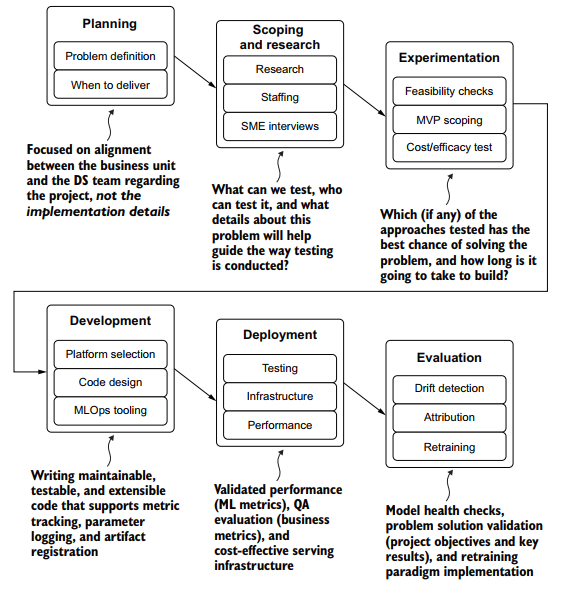
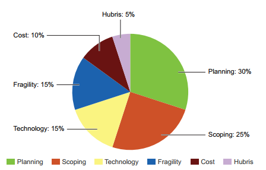
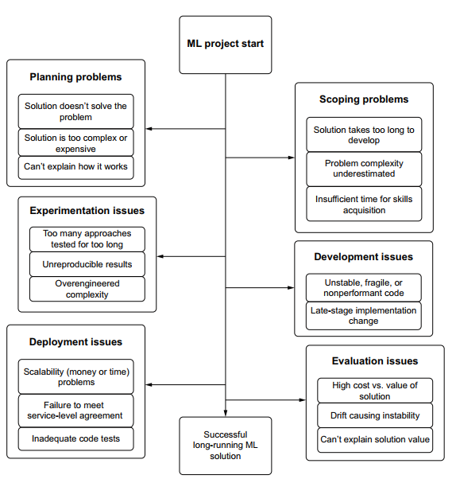
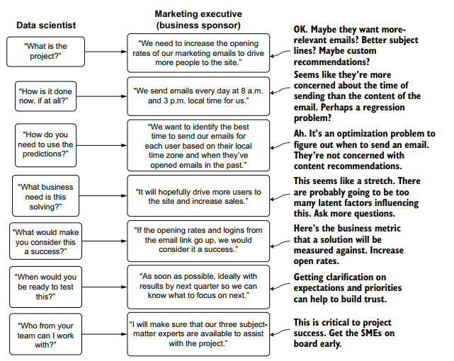
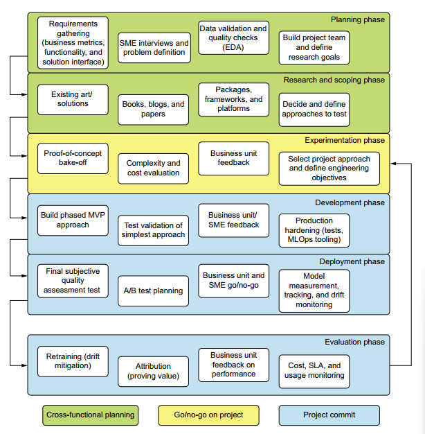

# What is machine Learning Engineering

ML engineering focus on creating system around the complex work of different specialists (Data Scientist, Data Engineers, Business unit, ...). With the use of tools, processes and methodologies, the aim is to build a system that is scalable, maintainable and minimizes the chances of abandonment and work need to solve the business problem with the accuracy proven to provide.

ML Engineers need to be proficient in data science, traditional software engineering and project management skills relevant to develop production-capable ML solutions.

ML Engineering road map is the steps of processes that guide the design of the ML solution to prevent rework, confusion, complexity and mainly failure.

<!-- 
 -->

|  | 
|:--:| 
| *ML Engineering road map for project work* |

<!-- 
 -->

## Why ML projects fail ?
Understanding why most ML projects fail is equally important as iterating through the steps of the road map. Learning from other projects is key in this field.

|  | 
|:--:| 
| *Estimation of why ML projects fail* |

In general, failures are due to:
* The inadequacy of the DS team in terms of experience or size in relevancy to the problem scale.
* Misunderstanding of the business goals:
  * lack of detail in project expectations
  * miscommunication owing to the challenging technical complexity.
* Relative industry immaturity in tooling.

|  | 
|:--:| 
| *ML project detours that lead to project failure* |

## The core principles os ML Engineering
An introduction of the tenets of ML Engineering and their problematic side.
### Planning
The planning phase needs to focus on **what will be built** and **why it needs to be built. Putting aside the technical details and the how it will be built question** by the DS team. This helps keep the attention on understanding the need, expectations and the end goal of the predictions.

|  | 
|:--:| 
| *An example of ML project planning discussion diagram* |

### Scoping and research
When it comes to research, two problematic mindsets exist:
* "Applicative ML", where engineers perceive ML as a quick win tool to solve the business problem.
* "Research ML", where engineers, and mostly academics, focus on innovation and discovery to advance the knowledge and research in ML field.

The first mindset might content its research to a brief reading of blogs and similar problems posted online and identify a solution that is simple and be delivered quickly. This could lead to oversight the true challenges of the problem, delivering under-performing solution and underestimating the development time.

The second mindset would go through a meticulous research phase, identify an advanced solution that was well studied. However, the solution can be too complex and time consuming to deliver or would require a big deal of resources and budget.

Finding the a middle ground between these two mindsets is key.

### Experimentation
Experimentation can go wrong if:
* The team patches together a quick solution that does not deliver and thus  erodes the trust and faith put in the team, along with money.
* The teams loses track of time, running multiple experiments and blows through the budget resulting in the cancellation of the project.

### Development
The Building of a code base involves multiple people adding and changing code daily. Having no development practices and poor deign can make the code break easily and be hard to improve with no features.

A moduralized code base is must have for easier collaboration on ML projects.

### Deployment

When Deploying models, engineers needs to strive for simplicity. By understanding and communicating the technical scale of the problems, the business unit can estimate better the budget and the profitability of the project.   
Ovoid underpowered strategies that render the predictions useless and overpowered strategies that burn money and adds complexity.

A couple deployment elements at different costs:
* **Prediction / Inference:**
  * **low cost:** offline training, offline serving
  * **high cost:** Active retraining, online serving
* **Prediction / Inference volumes:**
  * **low cost:** OLTP (table storage) batch predictions in KB-MB range
  * **high cost:** NoSQL/REST/edge Millions of predictions per day
* **Training / implementation complexity:**
  * **low cost:** Small data, simple model, minimal feature engineering
  * **high cost:** Extremely large data, ensembles, computationally complex model
* **Drift volatility:**
  * **low cost:** Relatively static, retraining on a scale of months
  * **high cost:** High concept / feature drift, retraining < every hour

### Evaluation
One crucial part of Evaluation that is often overlooked, is **how much is the solution profitable to the business**. This question takes into account all the aspects of the solution. So the impact of the model on the business side is fundamental to the project survival and need to be performed prior to deploying it to production.  
A/B testing and statistical models are the tool to tie the model to the business revenues.

## The goal of ML Engineering
The goal of ML Engineering goes back to the simple task of solving a problem. A problem that is difficult, monotonous or error-prune to be done by humans. The task can be mistaking, by enthusiasm, as creating a fancy solution or creating the most impressive research paper.  
The solution is built with statistics, algorithms and predictive models  
Keeping in mind the methodology of ML projects helps overcoming the complexity of these elements and possible failure.

|  | 
|:--:| 
| *ML project methodology component map* |

