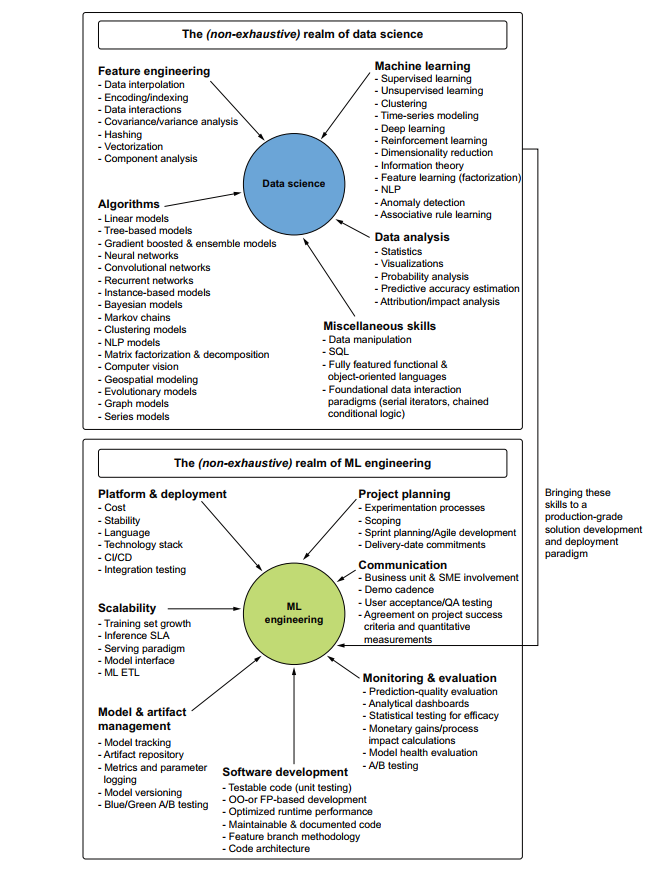
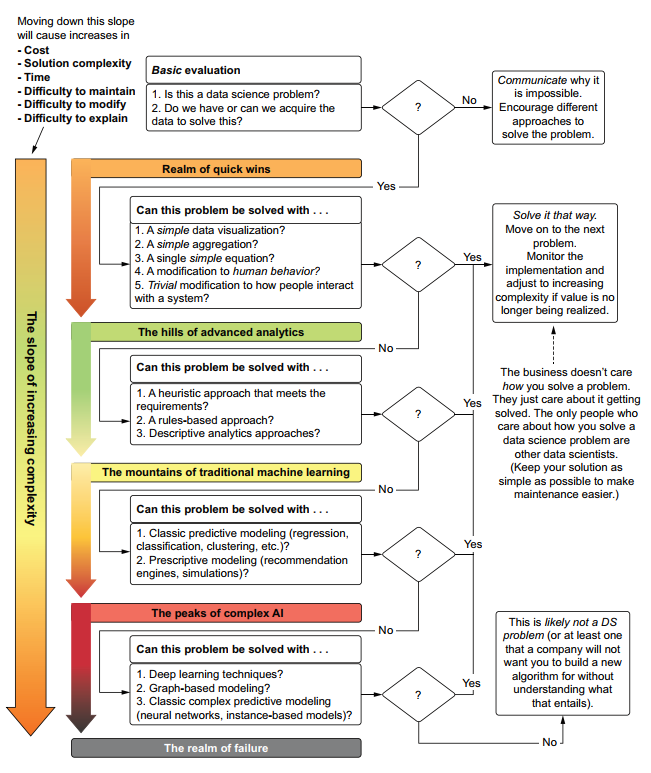
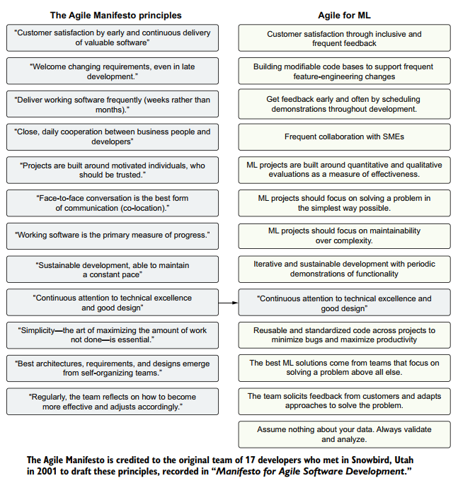
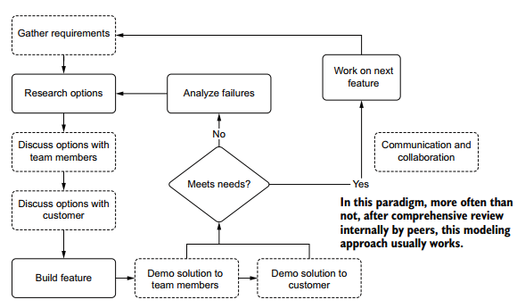
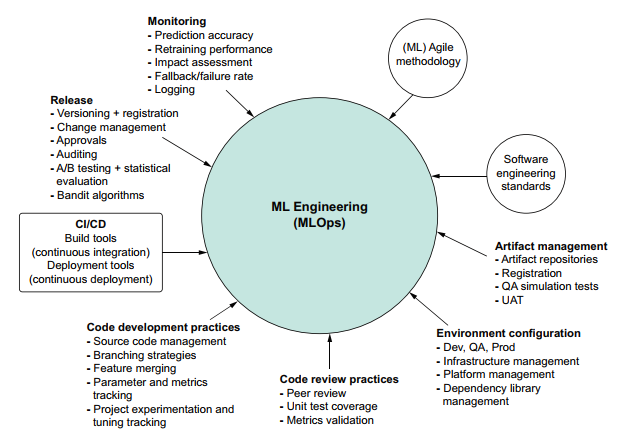

# Chapter 2: Your data science could use some engineering

The trinity core aspects of ML Engineering:
* Technology (tools, frameworks, algorithms)
* People (collaborative work, communication)
* Process (software development standards, experimentation rigor, Agile methodology)

For a project to succeed, the focus need to be shed of the three concept and not omit any of them.

What data scientist do is that "They solve problems through the creative application of mathematics to data." This cover a wide range of complex tool-sets and models (see top portion of bellow figure).  

ML Engineering build on the skills DS in constructive way that bring the solution to production (see bottom section of bellow figure).

|  | 
|:--:| 
| *The merging of software engineering and DS into ML engineer role* |

## A foundation of simplicity

Striving for simplicity if cardinal to ML projects. Many new comers and data scientist fall into pursuit of applying the latests technologies and buzzes. While the DS team value if measured in the quality, stability and cost-effectiveness and not the recency of the technology.  
Simple ML project secure the foundation of maintainable code base and workflows. Production projects are meant to last and therefore require updates, improvement and maintenance.

|  | 
|:--:| 
| *The simplistic approach of building an ML project* |

## Agile ML

The "Agile Manifesto Principles" changes the software development industry and capitalized on its past failures and immaturity. It brought forward principles and guidelines to guide professionals.  
The author proposes a version adapted to ML projects.

|  | 
|:--:| 
| *Agile principles of software and ML engineering* |

Two points Agile development, that boost the ml projects, are further detailed here:
 * **Communication and cooperation**:
    * The crucial aspect of ML projects are requires the least rework is communication. Communication with business unit, the internal development team and customer avoids divergence of expectations.  
    * Share your ideas with other team members to get feedback from other perspectives is beneficial and utilizes the power of cooperation.
    * Demonstrate the functionality of the solution and show visualizations of the output frequently to other team members and the customer. 
    

    |  | 
    |:--:| 
    | *ML Agile feature creation process, focusing on requirement gathering and feedback* |
    

* **Embracing and expecting change**:
  * Changes in the problem end goal are a real thing in ML projects even at the late stage. Anticipating these changes and preparing for them is only way around.
  * By building modular code base and keeping in mind the potential pivot directions, the impact can be minimized.
  * Iterative sprints that introduce new functionalities gradually makes the project more robust to abrupt changes.
  * In some case, there is no easy or simple solution to changes and large scale reworks are to be embraced.

## The foundation of  ML Engineering
In analogy to DevOps in software development, MLOps is a paradigm that encapsules the same principles but for ML projects.

|  | 
|:--:| 
| *ML Operations (MLOps)* |

